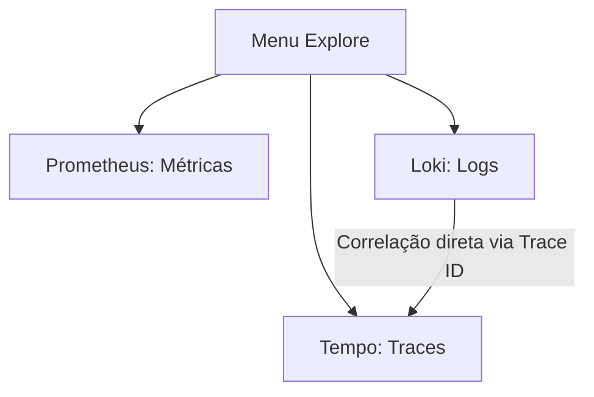

# Guia de Observabilidade: Aprendendo e Explorando a Stack LGTM no Grafana

Este guia foi desenhado para quem está começando com observabilidade em sistemas modernos. Aqui você aprenderá o que é a stack **LGTM**, os conceitos fundamentais do **OpenTelemetry** e como explorar métricas, logs e traces da sua aplicação no **Grafana**.

---

## 🧭 1. O que é a Stack LGTM?

A stack **LGTM** é um conjunto de ferramentas open-source da Grafana Labs projetado para fornecer uma solução completa de observabilidade para logs, métricas e rastreamentos (traces). Ela é composta por:

* **L (Loki):** Sistema de agregação de **Logs** focado em alta eficiência e baixo custo de armazenamento (inspirado no Prometheus).
* **G (Grafana):** A plataforma de visualização e painéis (Dashboards) onde consultamos e analisamos todos os dados.
* **T (Tempo):** Sistema de armazenamento de **Traces** (rastreamento distribuído) de alta escala, para acompanhar a jornada de uma requisição de ponta a ponta.
* **M (Mimir / Prometheus):** Banco de dados de séries temporais focado em **Métricas** numéricas rápidas e alertas.

Para conectar a nossa aplicação FastAPI a essas quatro ferramentas, usamos o **OpenTelemetry (OTel)**, um framework padrão de mercado para coletar, processar e exportar dados de telemetria.

---

## 📊 2. Conceitos: Os 3 Pilares da Observabilidade

No OpenTelemetry, trabalhamos com três pilares fundamentais: **Métricas**, **Logs** e **Traces**.

### 📈 Pilar 1: Métricas

Métricas são medidas numéricas coletadas ao longo do tempo. Elas são excelentes para responder a perguntas como: *"Quantas requisições estamos recebendo por segundo?"* ou *"Qual a latência de inferência do modelo?"*.

O OpenTelemetry possui diferentes tipos de instrumentos para registrar métricas:

1. **Counter (Contador):** Um valor numérico que **apenas aumenta** (monotônico). No Prometheus, ganha o sufixo `_total` automaticamente.
    * *Exemplo no App:* **`prediction_count`** (tipo Counter). Conta quantas predições o modelo realizou. É rotulado com o `model` e a intenção identificada (`intent`).
2. **UpDownCounter:** Um valor numérico que pode subir ou descer (ex: uso de memória, conexões ativas).
3. **Histogram (Histograma):** Mede a duração ou tamanho de eventos e os agrupa em intervalos definidos (buckets). Permite calcular médias, taxas e percentis (p95, p99).
    * *Exemplo no App:* **`prediction_latency_seconds`** (tipo Histogram). Mede a latência de processamento das predições em segundos. No Prometheus, gera três séries temporais:
        * `_bucket`: contagem em faixas de tempo.
        * `_sum`: a soma de todos os tempos registrados.
        * `_count`: a quantidade total de requisições de predição.
4. **Gauge (Medidor):** Representa um valor instantâneo flutuante (ex: temperatura de CPU).

### 📝 Pilar 2: Logs

Logs são registros textuais de eventos ocorridos em um momento específico. A integração no arquivo `observability.py` intercepta o logger padrão do Python e envia os logs estruturados automaticamente para o **Loki**.

### 🕸️ Pilar 3: Traces (Rastreamento)

Um trace acompanha o ciclo de vida completo de uma requisição pelo sistema. Cada etapa de uma requisição é chamada de **Span**. Ao visualizar um trace, você vê exatamente onde a requisição passou e quanto tempo demorou em cada função ou chamada de banco de dados.

---

## 🚀 3. Executando o Ambiente

Para inicializar a aplicação e toda a stack LGTM unificada:

1. **Suba os containers via Docker Compose:**
    Na raiz do projeto, rode:

    ```bash
    docker compose up --build
    ```

2. **Acesse o Grafana:**
    No seu navegador, entre em: [http://localhost:3000](http://localhost:3000)
    * **Usuário:** `admin`
    * **Senha:** `admin`

---

## ⚡ 4. Gerando Dados de Teste

Para ver os gráficos funcionando, precisamos enviar requisições para a API de predição:

```bash
# Execute estas requisições no seu terminal algumas vezes:
curl -X 'POST' \
  'http://localhost:8000/predict?text=Quero%20cancelar%20a%20minha%20assinatura' \
  -H 'accept: application/json' \
  -d ''

curl -X 'POST' \
  'http://localhost:8000/predict?text=Estou%20muito%20confuso%20com%20esse%20modelo' \
  -H 'accept: application/json' \
  -d ''
```

---

## 🔍 5. Explorando no Grafana

No menu lateral esquerdo do Grafana, clique em **Explore** (ícone de bússola 🧭).



### A. Consultando Métricas (Prometheus)

Selecione o data source **Prometheus** no topo esquerdo do Explore.

1. **Taxa de requisições por segundo por modelo e intenção:**

    ```promql
    sum(rate(prediction_count_total[5m])) by (model, intent)
    ```

2. **Tempo médio de inferência do modelo:**

    ```promql
    sum(rate(prediction_latency_seconds_sum[5m])) by (model) / sum(rate(prediction_latency_seconds_count[5m])) by (model)
    ```

3. **Percentil 95 (p95) da latência (95% das inferências são mais rápidas que este valor):**

    ```promql
    histogram_quantile(0.95, sum(rate(prediction_latency_seconds_bucket[5m])) by (le, model))
    ```

### B. Consultando Logs (Loki)

Selecione o data source **Loki** no Explore.

1. **Ver todos os logs da aplicação:**

    ```logql
    {service_name="mlops-container"}
    ```

2. **Filtrar apenas por erros:**

    ```logql
    {service_name="mlops-container"} |= "ERROR"
    ```

> [!TIP]
> **Correlação Logs 🔗 Traces:**
> Expanda qualquer linha de log listada. Devido à instrumentação do OTel, você verá metadados como `trace_id`. O Grafana disponibiliza um botão azul escrito **Tempo** ao lado do ID. Ao clicar nele, você abre o trace exato da requisição correspondente àquela linha de log!

### C. Consultando Rastreamento (Tempo)

Selecione o data source **Tempo** no Explore.

1. Mude a aba de consulta de *Query* para **Search**.
2. No campo **Service Name**, selecione `mlops-container`.
3. Clique em **Run Query** no topo direito.
4. Clique em um dos traces na lista de resultados para visualizar a cascata de spans e os tempos individuais de processamento.
